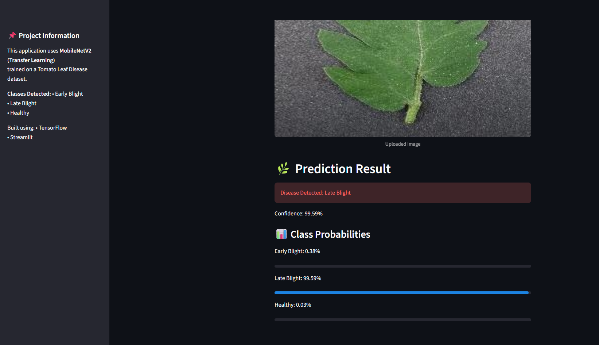

# 🌱 AI-Based Crop Disease Detection (Deep Learning + Streamlit)


[](https://cropdetectionsystem.streamlit.app)

---

## 🚀 Live Deployment

🔗 **Streamlit App:**  
https://cropdetectionsystem.streamlit.app  

> 🚀 Achieved ~96–97% test accuracy using Transfer Learning (MobileNetV2).

---

## 📸 App Preview



---

## 📌 Project Overview

An end-to-end deep learning system that detects tomato leaf diseases from images.

This project uses **Transfer Learning with MobileNetV2**, fine-tuned on a tomato leaf dataset to classify images into:

- Early Blight  
- Late Blight  
- Healthy  

The trained model is deployed publicly using **Streamlit Cloud**, allowing users to upload leaf images and receive real-time predictions with confidence scores.

This project demonstrates:

- CNN-based image classification  
- Transfer learning  
- Model fine-tuning  
- Performance evaluation  
- Web app deployment  
- Cloud hosting  

---

## 🚀 Features

- 🧠 Transfer Learning using MobileNetV2
- 🎯 Fine-tuning for improved accuracy
- 📊 Confusion Matrix & Classification Report
- 📈 Training & Validation accuracy visualization
- 🌐 Interactive Streamlit web app
- 📦 Model saved in native `.keras` format
- ☁️ Public deployment on Streamlit Cloud
- 📊 Class probability visualization

---

## 🧠 System Architecture

### 1️⃣ Data Preparation

- Image resizing to 224x224  
- Batch size: 32  
- Train / Validation / Test split  
- Sparse categorical labels  

---

### 2️⃣ Model Architecture

- Base Model: **MobileNetV2 (ImageNet pretrained)**
- Custom Top Layers:
  - GlobalAveragePooling2D  
  - Dense (ReLU)  
  - Dropout  
  - Dense (Softmax – 3 classes)

---

### 3️⃣ Fine-Tuning Strategy

- Unfroze last 20 layers of MobileNetV2  
- Reduced learning rate to 1e-5  
- Trained additional epochs  
- Improved validation stability  

---

## 📊 Final Model Performance

### ✅ Test Accuracy:
**~96–97%**

### 📈 Classification Report:

| Class              | Precision | Recall | F1-Score |
|--------------------|-----------|--------|----------|
| Early Blight       | 0.95      | 0.92   | 0.93     |
| Late Blight        | 0.97      | 0.96   | 0.97     |
| Healthy            | 0.97      | 1.00   | 0.98     |

The model shows strong balance across all classes.

---

## 💡 Real-World Impact

- Enables early disease detection  
- Reduces potential crop loss  
- Assists farmers with AI-based diagnosis  
- Demonstrates practical agricultural AI deployment  

This system balances **accuracy, efficiency, and deployability**.

---

## 🏗️ Project Structure

```text
AI-Based-Crop-Disease-Detection/
│
├── app.py                          # Streamlit web application
├── model/
│   └── tomato_disease_model.keras  # Trained deep learning model
│
├── notebooks/
│   ├── 01_Model_Training_and_Evaluation.ipynb
│   └── 02_Predict_Single_Image.ipynb
│
├── images/
│   ├── early_blight_sample.jpg
│   ├── late_blight_sample.jpg
│   └── healthy_sample.jpg
│
├── requirements.txt
└── README.md
```

---

## ▶️ How to Run Locally

### 1️⃣ Clone Repository

```bash
git clone https://github.com/nandithburla/AI-Based-Crop-Disease-Detection.git
cd AI-Based-Crop-Disease-Detection
```

### 2️⃣ Install Dependencies

```bash
pip install -r requirements.txt
```

### 3️⃣ Run Streamlit App

```bash
streamlit run app.py
```

Then open:

👉 http://localhost:8501

---

## 🔍 Prediction Workflow

1. User uploads image  
2. Image resized to 224x224  
3. Pixel values normalized  
4. Processed by MobileNetV2 model  
5. Softmax layer generates probabilities  
6. App displays:
   - Predicted class  
   - Confidence score  
   - Probability breakdown  

---

## 🚧 Future Improvements

- Grad-CAM heatmap visualization  
- Multi-crop disease support  
- Prediction history tracking  
- REST API version (FastAPI)  
- Docker containerization  
- Model versioning system  

---

## 👤 Author

**Nandu**  
GitHub: https://github.com/nandithburla  

---